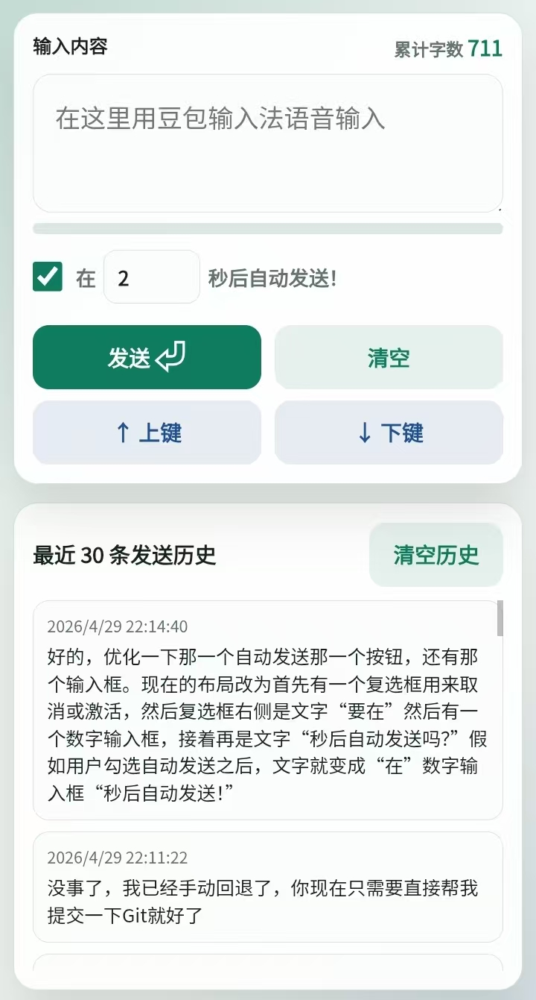

# Remote Input Board



Remote Input Board 是一个给 Windows 电脑用的“手机远程输入面板”。它的出发点很简单：手机上的豆包输入法语音识别很好用，但 PC 端没有那么顺手，所以这个工具让手机负责输入，电脑负责接收。

电脑启动服务后，手机浏览器打开同一局域网里的网页，就可以把手机输入框里的内容发送到电脑当前光标位置。它适合 AI Coding、聊天、写文档这类需要频繁输入长文本的场景：手机负责语音输入和快捷控制，电脑继续停留在编辑器或目标窗口里。

## 特色

- 不污染系统剪贴板：文字直接模拟输入到电脑当前光标位置。
- 适合手机语音输入：手机上用豆包输入法说话，电脑端立即收到文字。
- 自动发送：停止输入一段时间后自动发送，延迟秒数可以在手机网页里设置。
- 设置持久化：自动发送开关、自动发送延迟、累计字数和发送历史会保存在手机浏览器里。
- 快速发送：输入框有内容时按回车，会立刻发送当前内容。
- 空发送回车：输入框为空时点发送，相当于给电脑按一次回车。
- 方向键控制：页面提供上键和下键按钮，方便在 AI Coding 时切换候选项或历史命令。
- 触控板模式：手机页面可切换成鼠标触控板，支持滑动移动鼠标、单指左键、双指右键。
- 实时控制：鼠标移动、点击和方向键优先走 WebSocket，降低连续控制时的延迟。
- 历史回填：点击历史记录可重新填入输入框，已有内容时会先询问是否覆盖。
- 空退格同步：输入框为空时按手机退格，会同步给电脑按一次退格。
- 历史记录：手机端显示最近 30 条文本发送历史，刷新页面不会丢，手动清空才会删除。
- 累计字数：页面会显示已成功发送到电脑的累计字数。
- 崩溃找回：每次成功发送的文本会追加写入 `logs/input-history.log`。

## 使用方法

安装依赖并启动：

```powershell
uv run python -m py_remote_input
```

启动后终端会显示手机访问地址，例如：

```text
http://192.168.x.x:3210
```

让手机和电脑连到同一个局域网，用手机浏览器打开这个地址即可。

发送前请先在电脑上点好目标窗口和光标位置，比如记事本、聊天框、编辑器等。

## 可选配置

默认端口是 `3210`，可以用环境变量修改：

```powershell
$env:PORT='3219'; uv run python -m py_remote_input
```

## 日志

运行目录下会生成：

- `logs/server.log`：服务器运行日志。
- `logs/input-history.log`：文本输入历史，一行一条 JSON。

