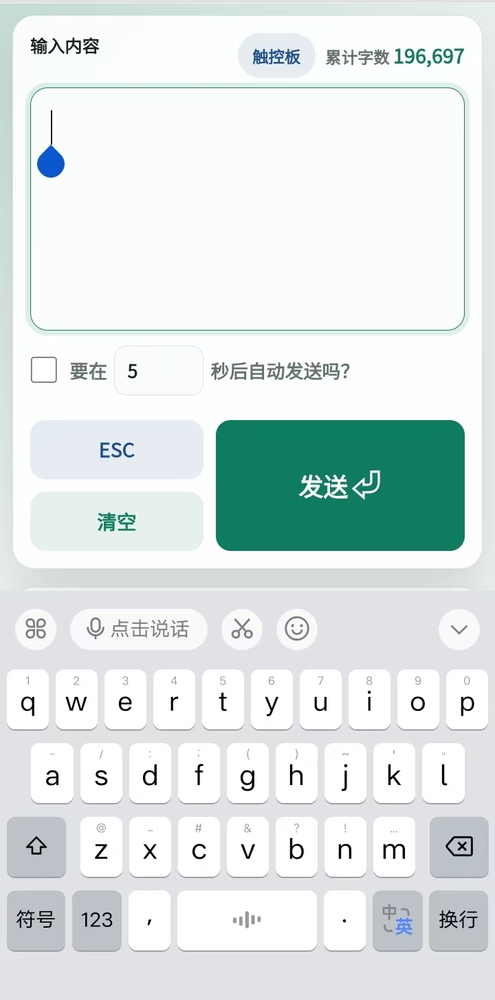
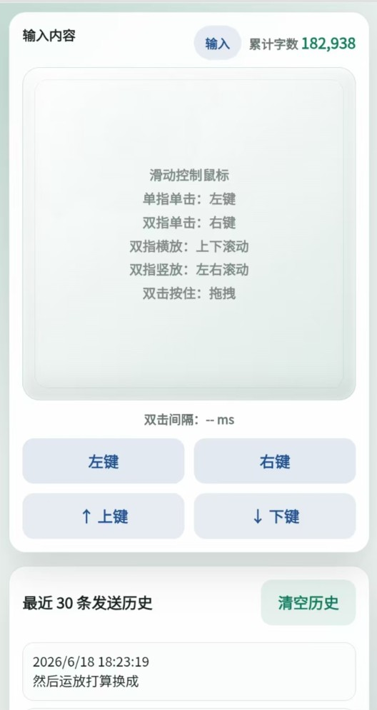
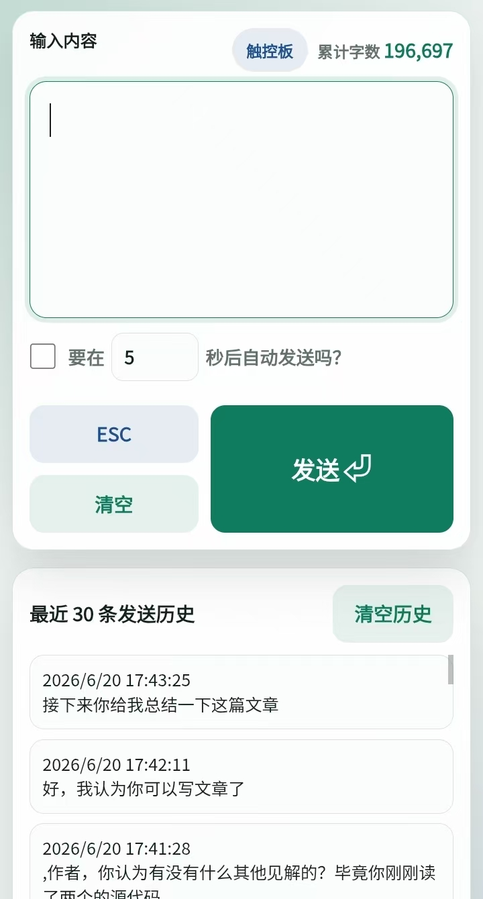

# Remote Input Board 📱→💻

**把手机变成你电脑的万能遥控器。说话输入、触控鼠标、键盘控制，一个网页全搞定。**

---

### 🤔 这是什么？

你有没有这种经历——在电脑上吭哧吭哧敲键盘，心想"要是能用手机上那个语音输入就好了"？或者躺在椅子上看代码，懒得起身去摸鼠标？

Remote Input Board 就是为这个而生的。电脑上跑一个小服务，手机浏览器打开网页，你的手机就变成了一个**远程输入终端**：

- 📢 **说话直接变文字**，用豆包输入法的语音识别，识别率完爆 PC 端
- 🖱️ **手机当触控板**，单指点击、双指滚动、双击拖拽，跟笔记本触摸板一样顺手
- ⌨️ **常用按键远程操控**，ESC、发送、清空这些高频动作不用碰键盘
- ⚙️ **两种输入方式** — 点 ⚙ 设置切换：默认「键盘输入」逐字模拟敲击，不碰剪贴板；切到「剪贴板粘贴」就把文字写入剪贴板再 Ctrl+V，专治终端、游戏等逐字敲击失灵的场景
- 🖥️ **一个手机控多台电脑** — ⚙ 设置里添加多台电脑地址，点选即切换；输入方式、服务器列表、快捷指令都存在手机本地，切到哪台都随身走

---

### 📸 界面预览

<table>
  <tr>
    <td align="center"><strong>🗣️ 语音输入</strong><br><sub>豆包输入法 → 电脑</sub></td>
    <td align="center"><strong>🖱️ 触控板</strong><br><sub>手机当鼠标用</sub></td>
    <td align="center"><strong>📋 历史记录</strong><br><sub>点击回填，自动滚回顶部</sub></td>
  </tr>
  <tr>
    <td></td>
    <td></td>
    <td></td>
  </tr>
</table>

---

### ✨ 为什么好用

**输入体验**

- ⌨️ **键盘输入（默认）** — 文字模拟键盘逐字输入，不碰剪贴板，你的 Ctrl+V 永远安全
- 📋 **剪贴板粘贴** — 在 ⚙ 设置里切换，文字写入剪贴板后 Ctrl+V，对终端、游戏等逐字敲击失效的地方更稳
- 🗣️ **豆包语音输入** — 手机用豆包说话，电脑光标处直接出字，比在电脑上打字快得多
- ⚡ **自动发送** — 停下来几秒就自动发，全程不用碰"发送"按钮
- ↩️ **回车即发送** — 输入框有内容按回车，瞬间送达

**操控能力**

- 🖱️ **全功能触控板** — 单指左键、双指右键、双指滚动、双击按住拖拽
- ⎋ **常用按键遥控** — ESC、发送、清空放在输入框下方，躺着就能操作
- 🌐 **WebSocket 实时通道** — 鼠标移动和点击更低延迟，跟手不卡顿

**贴心设计**

- 📝 **历史回填** — 点一下历史记录就填回输入框，覆盖前会问你，确认后自动滚到顶部
- 💾 **设置持久化** — 自动发送开关、延时、累计字数、发送历史，全存浏览器本地
- 🔢 **累计字数** — 看着数字涨上去，挺有成就感。以手机本地为准、服务器自动备份，换 IP / 换电脑 / 清缓存都靠「取最大值」合并找回，只增不减
- 🏚️ **崩溃找回** — 成功发送的文本都写进 `logs/input-history.log`，不怕丢

---

### 🚀 快速上手

电脑端一行启动：

```powershell
uv run python -m py_remote_input
```

终端会打印出手机访问地址：

```
http://192.168.x.x:3210
```

电脑和手机连同一个 WiFi，手机浏览器打开这个地址就行了。

> 💡 发送前先在电脑上点一下目标窗口（记事本、聊天框、编辑器都行），把光标放好。

---

### ⚙️ 配置

| 你想干嘛 | 怎么弄 |
|---------|-------|
| 改端口 | `$env:PORT='3219'; uv run python -m py_remote_input` |
| 调整自动发送延时 | 手机页面上的数字框，直接改 |
| 关掉自动发送 | 把勾取消就行 |

---

### 📦 打包成 exe

不带 Python 环境也能跑，一个 exe 搞定：

```powershell
.\.venv\Scripts\python.exe scripts\build_exe.py
```

输出在 `dist\RemoteInputBoard.exe`，双击即用。

---

### 🪵 日志

运行目录下自动生成：

| 文件 | 内容 |
|------|------|
| `logs/server.log` | 服务器运行日志 |
| `logs/input-history.log` | 发送历史，一行一条 JSON |

---

### 🏷️ 技术栈

`Python` `Flask` `WebSocket` `PyInstaller` `原生 JS（无框架）` `localStorage`

---

*适合 AI Coding、远程桌面、躺平办公等一切不想碰键盘的场景 ✌️*
